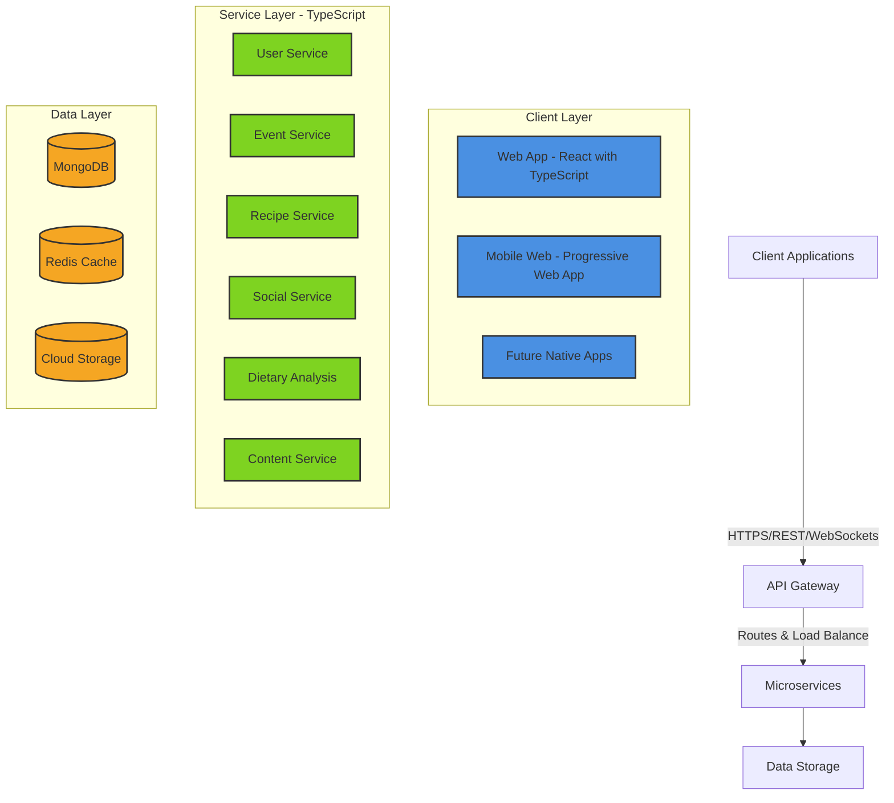

# System Architecture Design
# Olive Table

## 1. System Overview

### 1.1 Architecture Style
Olive Table follows a modern microservices architecture to ensure scalability and maintainability. The platform implements Domain-Driven Design principles with TypeScript for type safety across all services.

### 1.2 High-Level Architecture Diagram



### 1.3 Third-Party Integrations
- Authentication: Auth0 or Firebase Authentication
- Email Service: SendGrid
- Image Storage: AWS S3 or Google Cloud Storage
- Recipe API: Spoonacular or Edamam
- Calendar Integration: Google Calendar API
- Analytics: Google Analytics

## 2. Technology Stack

### 2.1 Frontend
- **Framework**: React.js with TypeScript
- **State Management**: Redux Toolkit with TypeScript support
- **UI Components**: Material-UI or Tailwind CSS
- **API Communication**: Axios with TypeScript interfaces
- **Real-time Updates**: Socket.io (with TypeScript types)
- **Build Tools**: Webpack, TypeScript compiler, ts-loader

### 2.2 Backend
- **API Framework**: Node.js with Express and TypeScript
- **Type Safety**: Full TypeScript integration across all services
- **Authentication**: JWT with refresh tokens (TypeScript interfaces)
- **API Documentation**: Swagger/OpenAPI with TypeScript integration
- **Validation**: Zod (TypeScript-first validation library)
- **Logging**: Winston with TypeScript types
- **Testing**: Jest with ts-jest, Supertest
- **Type Definitions**: @types packages for all dependencies
- **API Contracts**: Shared TypeScript interfaces between services

### 2.3 Database
- **Primary Database**: MongoDB
- **Caching**: Redis
- **Media Storage**: Cloud object storage (S3/GCS)
- **Database ORM/ODM**: Mongoose with TypeScript support
- **Type Safety**: TypeScript interfaces for all database models
- **Schema Validation**: MongoDB schema validation with TypeScript integration

### 2.4 DevOps
- **CI/CD**: GitHub Actions with TypeScript-aware workflows
- **Hosting**: AWS, Google Cloud, or Azure
- **Containerization**: Docker with TypeScript build process
- **Orchestration**: Kubernetes (future scale)
- **Monitoring**: Prometheus + Grafana
- **Type Checking**: TypeScript compiler in CI pipeline to catch type errors
- **Code Quality**: ESLint with TypeScript rules, Prettier

## 3. Service Descriptions

### 3.1 User Service
Manages user authentication, profiles, and dietary information.

#### Key Endpoints:
- `/api/users` - User CRUD operations
- `/api/users/profiles` - Dietary profile management
- `/api/users/households` - Family/group management
- `/api/auth` - Authentication endpoints

#### Data Models:
```typescript
interface IUser extends Document {
  email: string;
  passwordHash: string;
  firstName: string;
  lastName: string;
  friends: string[];  // For future social features
  dietaryProfiles: string[];
  createdAt: Date;
  updatedAt: Date;
}

interface IDietaryProfile extends Document {
  userId: string;
  name: string;
  ageGroup: string;
  allergies: IAllergy[];
  dietaryRestrictions: IDietaryRestriction[];
  preferences: IPreference[];
}
```

### 3.2 Event Service
Handles event creation, invitations, and RSVPs.

#### Key Endpoints:
- `/api/events` - Event CRUD operations
- `/api/events/invitations` - Invitation management
- `/api/events/rsvp` - RSVP handling

#### Data Models:
```typescript
interface IEvent extends Document {
  hostId: string;
  title: string;
  description: string;
  dateTime: Date;
  location: ILocation;
  eventType: string;
  beverageDesignation: string;
  invitees: string[];
  menu: IMenu;
  status: string;
}
```

### 3.3 Recipe Service
Manages recipes, modifications, and dietary compatibility.

#### Key Endpoints:
- `/api/recipes` - Recipe CRUD operations
- `/api/recipes/search` - Recipe search
- `/api/recipes/modifications` - Recipe modification suggestions

#### Data Models:
```typescript
interface IRecipe extends Document {
  name: string;
  description: string;
  ingredients: IIngredient[];
  instructions: string[];
  dietaryTags: string[];
  culturalOrigin: string;
  nutritionalInfo: INutrition;
}
```

### 3.4 Social Service
Handles social interactions, sharing, and comments.

#### Key Endpoints:
- `/api/social/posts` - Post CRUD operations
- `/api/social/comments` - Comment management
- `/api/social/follows` - Follow relationships
- `/api/social/discover` - Discovery feed

#### Data Models:
```typescript
interface IPost extends Document {
  userId: string;
  content: string;
  images: string[];
  type: PostType;
  tags: string[];
  productLink?: string;
  likes: string[];
  comments: string[];
}
```

### 3.5 Dietary Analysis Service
Processes group dietary needs and generates compatibility reports.

#### Key Endpoints:
- `/api/analysis/group` - Group dietary analysis
- `/api/analysis/compatibility` - Food compatibility checking
- `/api/analysis/suggestions` - Menu suggestions

#### Data Models:
```typescript
interface ICompatibilityReport extends Document {
  eventId: string;
  groupAnalysis: IDietaryAnalysis;
  recommendations: IRecommendation[];
  lastUpdated: Date;
}
```

### 3.6 Content Service
Manages creator profiles and content integration.

#### Key Endpoints:
- `/api/creators` - Creator profile management
- `/api/content` - Content CRUD operations
- `/api/content/embed` - External content embedding

#### Data Models:
```typescript
interface ICreator extends Document {
  userId: string;
  name: string;
  bio: string;
  verified: boolean;
  platforms: IPlatform[];
  content: string[];
}
```

## 4. Database Schema

### 4.1 MongoDB Collections

#### Users Collection
```typescript
const UserSchema = new Schema<IUser>({
  email: { type: String, required: true, unique: true },
  passwordHash: { type: String, required: true },
  firstName: String,
  lastName: String,
  friends: [{ type: Schema.Types.ObjectId, ref: 'User' }],
  dietaryProfiles: [{ type: Schema.Types.ObjectId, ref: 'DietaryProfile' }],
  settings: {
    notifications: Object,
    privacy: Object
  }
}, { timestamps: true });
```

#### Events Collection
```typescript
const EventSchema = new Schema<IEvent>({
  hostId: { type: Schema.Types.ObjectId, ref: 'User', required: true },
  title: { type: String, required: true },
  description: String,
  dateTime: { type: Date, required: true },
  location: {
    address: String,
    coordinates: [Number, Number]
  },
  eventType: String,
  beverageDesignation: String,
  invitees: [{ type: Schema.Types.ObjectId, ref: 'User' }],
  menu: {
    confirmed: [{ type: Schema.Types.ObjectId, ref: 'Recipe' }],
    proposed: [{ type: Schema.Types.ObjectId, ref: 'Recipe' }]
  },
  status: String
}, { timestamps: true });
```

## 5. Security Architecture

### 5.1 Authentication Flow with TypeScript
```typescript
interface JWTPayload {
  userId: string;
  email: string;
  roles: string[];
  iat?: number;
  exp?: number;
}

interface AuthTokens {
  accessToken: string;
  refreshToken: string;
}
```

1. User logs in with credentials
2. Backend validates and issues typed JWT tokens
3. TypeScript middleware ensures type-safe token validation
4. Resource-based authorization with typed user context

### 5.2 API Contract Enforcement
```typescript
interface APIResponse<T> {
  success: boolean;
  data?: T;
  error?: {
    code: string;
    message: string;
  };
}

type UserResponse = APIResponse<IUser>;
type EventResponse = APIResponse<IEvent>;
```

## 6. TypeScript Infrastructure

### 6.1 Shared Type Definitions
```typescript
// @olive-table/types package
export interface IUser { ... }
export interface IEvent { ... }
export interface IRecipe { ... }

// API Contract Types
export interface CreateEventRequest { ... }
export interface CreateEventResponse { ... }
```

### 6.2 Interface Sharing
- Frontend and backend share the same type definitions
- API request/response interfaces ensure contract compliance
- Database model interfaces extend Document for Mongoose
- Validation schemas derive from TypeScript interfaces

### 6.3 Development Workflow
```typescript
// tsconfig.json (shared configuration)
{
  "compilerOptions": {
    "target": "es2020",
    "module": "commonjs",
    "strict": true,
    "esModuleInterop": true,
    "skipLibCheck": true,
    "sourceMap": true
  },
  "include": ["src/**/*.ts"],
  "exclude": ["node_modules", "dist"]
}
```

## 7. MVP Implementation Phases

### Phase 1: TypeScript Foundation
- TypeScript infrastructure setup
- Shared type definitions package
- Core database schemas with TypeScript
- Type-safe authentication service

### Phase 2: Core Features with TypeScript
- Type-safe user profile management
- Strongly-typed event creation
- TypeScript-powered dietary analysis
- Type-safe recipe management

### Phase 3: Social Features
- Type-safe friend connections
- Strongly-typed social feed
- TypeScript-enabled creator profiles
- Type-safe discovery sharing

### Phase 4: Refinement
- Performance optimization
- Enhanced type coverage
- UI/UX improvements
- Bug fixes and monitoring

## 8. Post-MVP Expansion with TypeScript

### Future Services
- Recommendation Engine (TypeScript ML models)
- Analytics Service (TypeScript data processing)
- Advanced Search Service (TypeScript search algorithms)
- Monetization Service (TypeScript payment types)
- Notification Service (TypeScript websocket types)

All future services will maintain strict TypeScript implementation for type safety, better developer experience, and reduced runtime errors.