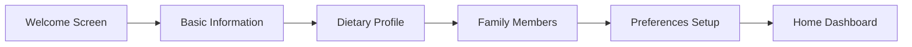
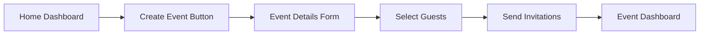
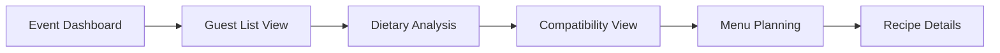
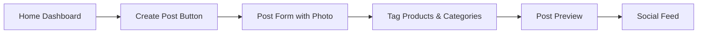

# UI/UX Design and Wireframes
# Olive Table

## 1. Design System

### 1.1 Color Palette

- **Primary Color**: #4E9F3D (Green) - Represents health, freshness, and nature
- **Secondary Color**: #8C5E58 (Terra Cotta) - Warm, inviting color associated with cooking and gatherings
- **Accent Color**: #F39237 (Orange) - Energetic, appetizing color for calls-to-action
- **Neutral Colors**:
  - #F5F5F5 (Light Gray) - Background
  - #333333 (Dark Gray) - Primary text
  - #757575 (Medium Gray) - Secondary text
- **Feedback Colors**:
  - #E53935 (Red) - Error, allergies, incompatible
  - #FFC107 (Amber) - Warning, moderate compatibility
  - #43A047 (Green) - Success, high compatibility

### 1.2 Typography

- **Primary Font**: 'Nunito Sans' - Clean, friendly, and highly readable
- **Secondary Font**: 'Montserrat' - For headings and emphasis
- **Sizes**:
  - Heading 1: 32px
  - Heading 2: 24px
  - Heading 3: 20px
  - Body: 16px
  - Small: 14px
  - Caption: 12px

### 1.3 Iconography

- Outlined style for consistency
- Custom food and dietary icons for restrictions
- Standard icons for navigation and actions

### 1.4 Components

- **Buttons**:
  - Primary: Filled green with white text
  - Secondary: Outlined with green text
  - Tertiary: Text only with no background
- **Cards**:
  - Rounded corners (8px)
  - Light shadow
  - White background
- **Form Elements**:
  - Clear input fields with bottom borders
  - Toggle switches for binary options
  - Sliders for flexibility scales
- **Compatibility Indicators**:
  - Circular icons with colors indicating compatibility level
  - Small badges for dietary restrictions

## 2. Key User Flows

### 2.1 User Registration and Profile Creation



### 2.2 Event Creation and Invitation



### 2.3 Dietary Compatibility Analysis



### 2.4 Food Discovery Sharing



## 3. Wireframes for Key Screens

### 3.1 Profile Creation Screen

```
┌──────────────────────────────────────────────────────┐
│ Olive Table                                      ☰   │
├──────────────────────────────────────────────────────┤
│                                                      │
│  Create Your Dietary Profile                         │
│                                                      │
│  ┌────────────────────────────────────────────────┐  │
│  │ Profile Name: [________________]               │  │
│  │                                                │  │
│  │ Age Group:   [Select▼]                         │  │
│  │                                                │  │
│  │ Allergies & Intolerances:                      │  │
│  │ [_________________________________________]     │  │
│  │ + Add Another                                  │  │
│  │                                                │  │
│  │ Dietary Restrictions:                          │  │
│  │ ☐ Vegetarian                                   │  │
│  │ ☐ Vegan                                        │  │
│  │ ☐ Gluten-Free                                  │  │
│  │ ☐ Dairy-Free                                   │  │
│  │ ☐ Kosher                                       │  │
│  │ ☐ Halal                                        │  │
│  │ ☐ Other: [________________]                    │  │
│  │                                                │  │
│  │ Flexibility Level:                             │  │
│  │ Very Strict ○───○───●───○───○ Very Flexible    │  │
│  │                                                │  │
│  └────────────────────────────────────────────────┘  │
│                                                      │
│  [Back]                               [Next Step ▶]  │
│                                                      │
└──────────────────────────────────────────────────────┘
```

### 3.2 Event Creation Screen

```
┌──────────────────────────────────────────────────────┐
│ Olive Table                                      ☰   │
├──────────────────────────────────────────────────────┤
│                                                      │
│  Create New Gathering                                │
│                                                      │
│  ┌────────────────────────────────────────────────┐  │
│  │ Event Name: [________________]                 │  │
│  │                                                │  │
│  │ Date: [__/__/____]    Time: [__:__ ▼]         │  │
│  │                                                │  │
│  │ Location: [_________________________________]  │  │
│  │                                                │  │
│  │ Event Type:                                    │  │
│  │ ○ Dinner Party                                 │  │
│  │ ○ Potluck                                      │  │
│  │ ○ Brunch                                       │  │
│  │ ○ Holiday Meal                                 │  │
│  │ ○ Other: [________________]                    │  │
│  │                                                │  │
│  │ Beverage Selection:                            │  │
│  │ ○ Sober-Friendly                               │  │
│  │ ○ Light Alcohol                                │  │
│  │ ○ Full Bar                                     │  │
│  │                                                │  │
│  └────────────────────────────────────────────────┘  │
│                                                      │
│  [Cancel]                       [Continue to Guests] │
│                                                      │
└──────────────────────────────────────────────────────┘
```

### 3.3 Dietary Analysis Screen

```
┌──────────────────────────────────────────────────────┐
│ Olive Table                                      ☰   │
├──────────────────────────────────────────────────────┤
│                                                      │
│  Dietary Analysis for "Dinner Party"                 │
│                                                      │
│  ┌────────────────────────────────────────────────┐  │
│  │ Group Overview:                        [Print] │  │
│  │                                                │  │
│  │ ┌──────────────────────────────────────────┐   │  │
│  │ │ Key Restrictions:                         │   │  │
│  │ │ ● Dairy-Free (2 guests)                   │   │  │
│  │ │ ● Gluten-Free (1 guest)                   │   │  │
│  │ │ ● Vegetarian (1 guest)                    │   │  │
│  │ └──────────────────────────────────────────┘   │  │
│  │                                                │  │
│  │ Compatibility Chart:                           │  │
│  │ [Visual Venn diagram showing overlapping      │  │
│  │  dietary restrictions with color-coded        │  │
│  │  indicators]                                  │  │
│  │                                                │  │
│  │ Foods to Avoid:                                │  │
│  │ ⊗ Dairy products                               │  │
│  │ ⊗ Gluten-containing grains                     │  │
│  │ ⊗ Meat dishes (for Lisa)                       │  │
│  │                                                │  │
│  └────────────────────────────────────────────────┘  │
│                                                      │
│  [Back]                         [Explore Recipes ▶]  │
│                                                      │
└──────────────────────────────────────────────────────┘
```

### 3.4 Recipe Recommendations Screen

```
┌──────────────────────────────────────────────────────┐
│ Olive Table                                      ☰   │
├──────────────────────────────────────────────────────┤
│                                                      │
│  Recommended Recipes for "Dinner Party"              │
│                                                      │
│  Filters:  [All▼]  [Compatibility▼]  [Cuisine▼]     │
│                                                      │
│  ┌────────────────────────────────────────────────┐  │
│  │ Mediterranean Roasted Vegetables               │  │
│  │ ★★★★☆ (4.5) | ●●●● Compatible with all        │  │
│  │                                                │  │
│  │ [Image of roasted vegetables]                  │  │
│  │                                                │  │
│  │ Dairy-free, Gluten-free, Vegetarian           │  │
│  │ [View Recipe]      [Add to Menu]               │  │
│  └────────────────────────────────────────────────┘  │
│                                                      │
│  ┌────────────────────────────────────────────────┐  │
│  │ Herb-Crusted Salmon                            │  │
│  │ ★★★★★ (5.0) | ●●● Compatible with 3 guests     │  │
│  │                                                │  │
│  │ [Image of salmon dish]                         │  │
│  │                                                │  │
│  │ Dairy-free, Gluten-free                       │  │
│  │ ⚠ Not suitable for: Lisa (Vegetarian)         │  │
│  │ [View Recipe]      [Add to Menu]               │  │
│  └────────────────────────────────────────────────┘  │
│                                                      │
└──────────────────────────────────────────────────────┘
```

### 3.5 Discovery Feed Screen

```
┌──────────────────────────────────────────────────────┐
│ Olive Table                                      ☰   │
├──────────────────────────────────────────────────────┤
│                                                      │
│  Discover                           [+] Share New    │
│                                                      │
│  Filters: [All] [Drinks] [Snacks] [Equipment]        │
│                                                      │
│  ┌────────────────────────────────────────────────┐  │
│  │ Sarah Chen                                     │  │
│  │ @sarah_health · 2 hours ago                    │  │
│  │                                                │  │
│  │ Just discovered this amazing Japanese matcha    │  │
│  │ from Uji region! Perfect for my morning ritual  │  │
│  │                                                │  │
│  │ [Image of matcha powder]                       │  │
│  │                                                │  │
│  │ 📍 Purchased at: Maruzen Tea Shop              │  │
│  │ 🏷️ Tags: #matcha #green-tea #morning-ritual    │  │
│  │                                                │  │
│  │ ♥ 24  💬 5  🔄 Share  💾 Save                   │  │
│  └────────────────────────────────────────────────┘  │
│                                                      │
│  ┌────────────────────────────────────────────────┐  │
│  │ Michael Kim                          [Verified]│  │
│  │ @mike_chef · 5 hours ago                       │  │
│  │                                                │  │
│  │ Made this smoothie with my Nama J2 coldpress:   │  │
│  │ - 1 cup spinach                                │  │
│  │ - 1 apple                                      │  │
│  │ - 1 celery stalk                               │  │
│  │ - 1 inch ginger                                │  │
│  │                                                │  │
│  │ [Image of green smoothie]                      │  │
│  │                                                │  │
│  │ 🥤 Recipe saved by 12 users                    │  │
│  │ 🏷️ Tags: #green-juice #nama-juicer #healthy    │  │
│  │                                                │  │
│  │ ♥ 47  💬 12  🔄 Share  💾 Save                  │  │
│  └────────────────────────────────────────────────┘  │
│                                                      │
└──────────────────────────────────────────────────────┘
```

### 3.6 Content Creator Profile Screen

```
┌──────────────────────────────────────────────────────┐
│ Olive Table                                      ☰   │
├──────────────────────────────────────────────────────┤
│                                                      │
│ [Cover Photo]                                        │
│                                                      │
│ ┌───┐ Lisa Wong                          [Verified] │
│ │ P │ Chef & Wellness Coach                          │
│ │ R │ 125K followers · Gluten-Free Specialist        │
│ │ O │                                                │
│ │ F │ [Follow]  📺 YouTube  📸 Instagram              │
│ └───┘                                                │
│                                                      │
│ ─────────────────────────────────────────────────────│
│                                                      │
│ About                                                │
│ Passionate about creating gluten-free recipes that    │
│ everyone can enjoy. Specializing in Asian cuisine     │
│ adaptations for dietary needs.                       │
│                                                      │
│ Content                                              │
│ ┌────────────────────┐ ┌────────────────────┐       │
│ │ Gluten-Free Pad    │ │ Dairy-Free Ramen   │       │
│ │ Thai Recipe Video  │ │ Tutorial Series    │       │
│ │ ★★★★★ 2.5K views  │ │ ★★★★☆ 5.2K views  │       │
│ └────────────────────┘ └────────────────────┘       │
│                                                      │
│ ┌────────────────────┐ ┌────────────────────┐       │
│ │ Weekly Meal Prep  │ │ Healthy Asian Snack│       │
│ │ Live Session      │ │ Ideas Collection   │       │
│ │ Today 7pm EST     │ │ ★★★★★ 8.1K views  │       │
│ └────────────────────┘ └────────────────────┘       │
│                                                      │
└──────────────────────────────────────────────────────┘
```

## 4. Interaction Patterns

### 4.1 Compatibility Indicators
- Color-coded circles: Green (100% compatible), Yellow (Partial), Red (Incompatible)
- Numerical scores with breakdown on tap/hover
- Quick glance indicators with detailed views on demand

### 4.2 Dietary Restriction Badges
- Small pill-shaped indicators with restriction abbreviations
- Color-coded by type (Allergy, Religious, Preference, Medical)
- Expandable for more details

### 4.3 Event Timeline
- Visual timeline for preparation and event schedule
- Drag-and-drop task reordering
- Color-coded by task type (Prep, Shopping, Cooking)

### 4.4 Social Feed Interactions
- Double-tap to like posts
- Swipe left for quick actions (Save, Share, Comment)
- Pull-down to refresh
- Infinite scroll for continuous browsing

## 5. Responsive Design

### 5.1 Breakpoints
- Mobile: 320px - 480px
- Tablet: 481px - 1024px
- Desktop: 1025px+

### 5.2 Adaptive Layouts
- Collapsible navigation for mobile
- Stacked cards on smaller screens
- Responsive typography scaling
- Touch-friendly targets (44px minimum)

## 6. Accessibility Features

### 6.1 Visual
- High contrast mode option
- Scalable text sizes
- Color blindness considerations
- Clear visual hierarchy

### 6.2 Navigation
- Keyboard navigation support
- Screen reader compatibility
- Clear focus indicators
- Alternative text for images

### 6.3 Content
- Clear error messages
- Simple language options
- Consistent UI patterns
- Progress indicators

## 7. Animation and Transitions

### 7.1 Micro-interactions
- Button press animations
- Loading states
- Success celebrations
- Error indicators

### 7.2 Page Transitions
- Smooth navigation animations
- Content loading states
- Dismissible notifications
- Contextual help tooltips

## 8. Dark Mode

### 8.1 Color Adjustments
- Inverted color scheme
- Reduced brightness
- Maintained contrast ratios
- Adjusted image opacity

### 8.2 User Preference
- System preference detection
- Manual toggle option
- Saved user preferences
- Smooth theme transitions