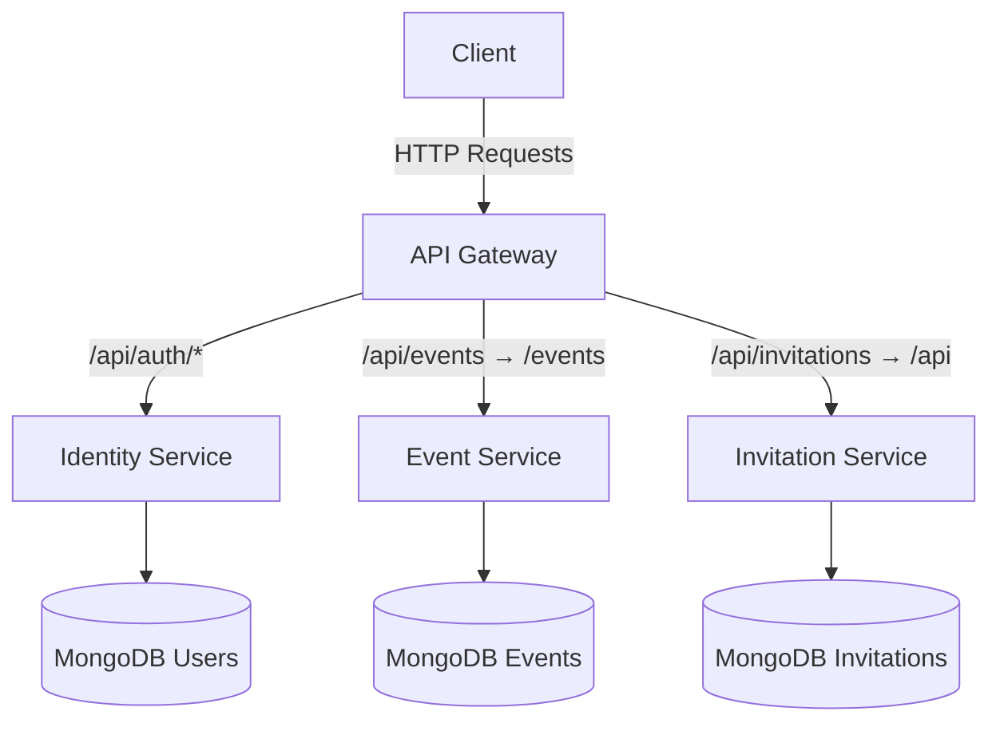

# Olive Table - API Gateway & Microservices

This repository contains a microservices architecture with:
- **API Gateway**: Reverse proxy with JWT authentication and path rewriting
- **Identity Service**: User registration and authentication
- **Event Service**: Event management (CRUD operations)
- **Invitation Service**: Invitation and RSVP management

## Architectural Overview



## Key Components

1. **API Gateway** (`/services/api-gateway`)
  - Entry point for all requests
  - Handles:
    - JWT Authentication
    - Path Rewriting:
      - `/api/auth/*` -> Identity Service

## Prerequisites

Before running the application, ensure you have the following installed:

- [Node.js](https://nodejs.org/) (LTS version recommended)
- [Docker](https://www.docker.com/) (for containerization)
- [Docker Compose](https://docs.docker.com/compose/) (for managing multi-container Docker applications)

## Project Structure

- **API Gateway**: Handles routing, authentication, and proxying requests to other services.
- **Event Service**: Manages event-related data and operations.

## Setup & Installation

### Clone the Repository

```bash
git clone https://github.com/your-repo-name.git
cd your-repo-name
```

### Environment Variables

Ensure you have the following environment variables set up before running the services. These values can be set in `.env` files or your system's environment.

```bash
# Example environment variables for the services

# JWT secret used for token verification in API Gateway
JWT_SECRET=your_jwt_secret

# Service URLs for API Gateway to proxy requests to
SERVICES_IDENTITY=http://identity-service
SERVICES_EVENTS=http://event-service
SERVICES_INVITATIONS=http://invitation-service
```

### Docker Compose (Optional)

If you want to run the services in Docker containers, use Docker Compose to start the entire stack.

```bash
docker-compose up --build
```

### Running the API Gateway and Event Service Locally

1. **Start the Event Service**: This service will handle event-related requests.

```bash
cd services/event-service
npm install
npm start
```

2. **Start the API Gateway**: This will act as the reverse proxy for other services.

```bash
cd services/api-gateway
npm install
npm start
```

### Health Check Endpoint

Both the API Gateway and the Event Service expose a health check endpoint.

- API Gateway Health Check: `http://localhost:3000/health`
- Event Service Health Check: `http://localhost:3002/health`

To check if the services are running, you can use `curl`:

```bash
curl http://localhost:3000/health  # Should return { "status": "ok" }
curl http://localhost:3002/health  # Should return { "status": "ok" }
```

## Authentication

The API Gateway uses JWT tokens for authentication. To access protected endpoints (such as creating events), you must include a valid JWT token in the `Authorization` header.

### Register and Get Token
Register a user via the `POST /api/auth/register` endpoint (you'll need to implement the registration logic).

After registration, you'll receive a JWT token, which can be used to authenticate requests to protected routes.

## Example `curl` Commands

### Creating an Event

Once you have a valid JWT token and `creatorId` (from registering), use the following `curl` command to create an event via the API Gateway.

`curl` **Command for Creating an Event**
```bash
curl -X POST http://localhost:3000/api/events \
  -H "Content-Type: application/json" \
  -H "Authorization: Bearer YOUR_JWT_TOKEN_HERE" \
  -d '{
    "title": "Gateway Test Event",
    "description": "Created via API Gateway",
    "date": "2025-04-30",
    "startTime": "19:00",
    "location": "Gateway Location",
    "visibility": "public",
    "creatorId": "YOUR_CREATOR_ID_HERE"
  }'
```

- `YOUR_JWT_TOKEN_HERE`: Replace with your JWT token that you receive after registering/authenticating.
- `YOUR_CREATOR_ID_HERE`: Replace with the creatorId value (the ID of the user creating the event).

### Example of Response

```json
{
  "title": "Gateway Test Event",
  "description": "Created via API Gateway",
  "creatorId": "6806d60c64ac1001fa56d52e",
  "date": "2025-04-30T00:00:00.000Z",
  "startTime": "19:00",
  "location": "Gateway Location",
  "visibility": "public",
  "dietary": {
    "preferences": [],
    "restrictions": []
  },
  "_id": "6806ee18e5c93374944f61c8",
  "createdAt": "2025-04-22T01:17:12.062Z",
  "updatedAt": "2025-04-22T01:17:12.067Z",
  "__v": 0
}
```

## Debugging and Logs

Both services (API Gateway and Event Service) log useful information to the console for debugging.
To tail logs for a specific service, use:
```bash
docker-compose logs -f api-gateway  # Logs for the API Gateway service
docker-compose logs -f event-service  # Logs for the Event Service
```
Or, if running locally:
```bash
# View logs for API Gateway
tail -f services/api-gateway/logs/app.log

# View logs for Event Service
tail -f services/event-service/logs/app.log
```

## API Gateway Flow

The API Gateway routes requests based on the URL pattern. For example:

- **Auth Routes**: Routes starting with `/api/auth` are forwarded to the authentication service (no authentication required).
- **Protected Routes**: Routes starting with `/api/events` and `/api/invitations` require a valid JWT token to be forwarded to the event or invitation service.

The proxy functionality also rewrites paths to ensure requests are properly forwarded to the respective services. For example:

- `/api/events` is rewritten to /events for the Event Service.
- `/api/invitations` is rewritten to /api for the Invitations Service.

## Error Handling

Both services have centralized error handling:

- **API Gateway**: Returns 404 for undefined routes and 500 for internal server errors.
- **Event Service**: Returns 404 for undefined routes and 500 for internal server errors.

## Additional Information

### Event Service Routes

- `GET /events`: Fetch all events.
- `GET /events/:id`: Fetch an event by ID.
- `POST /events`: Create a new event.
- `PUT /events/:id`: Update an event by ID.
- `DELETE /events/:id`: Delete an event by ID.

### API Gateway Logging

The API Gateway logs the following:

- Authentication status for protected routes.
- Path rewrites and forwarding to the correct service.
- HTTP request/response details (e.g., status code, response time).

---

This README provides a high-level overview of the project setup, usage, and testing of the endpoints. Please make sure to replace the placeholders with your own credentials and IDs to ensure proper functionality.