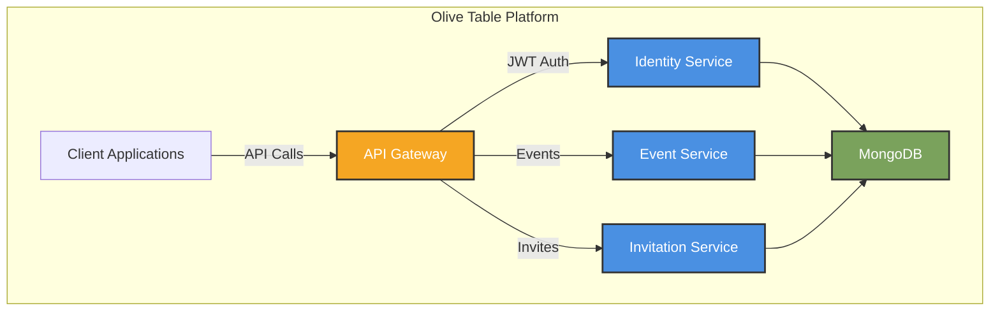
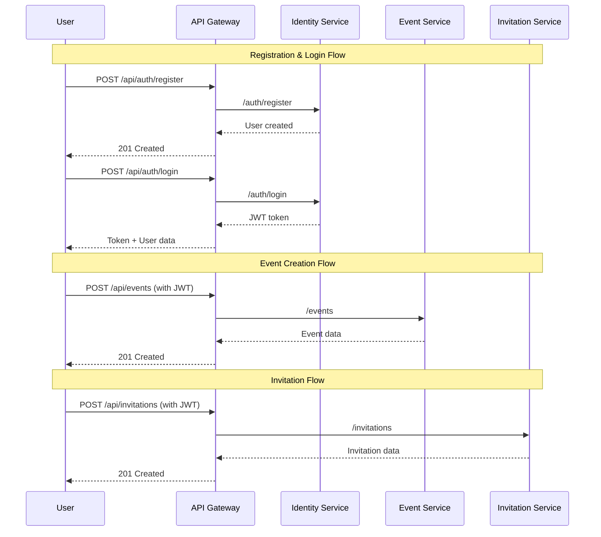

# Olive Table

<div align="center">
  
  
  **A dietary-aware social gathering platform that brings people together around food, regardless of dietary restrictions.**
  
  [](CONTRIBUTING.md) [](LICENSE)
</div>

---

## 🌿 About Olive Table

Just as an olive tree symbolizes peace, wisdom, and abundance, Olive Table fosters meaningful connections around food. We believe that breaking bread together should unite, not exclude—our platform ensures dietary restrictions never keep anyone from the table.

**Our Mission**: Make inclusive meal planning effortless by helping hosts account for all dietary needs while maintaining celebration and community.

---

## ✨ Key Features

### 🍽️ Smart Event Planning
- Create dietary-aware events and gatherings
- Automatic guest dietary profile collection
- Visual dietary compatibility dashboard
- Intelligent menu recommendations

### 👥 User Management
- Detailed dietary profile creation
- Household and family member support
- Flexible restriction severity levels
- Social connection management

### 📊 Dietary Intelligence
- Group compatibility analysis
- Common restrictions visualization
- Accommodation suggestions
- Real-time dietary requirement tracking

---

## 🏗️ Architecture

Olive Table is built as a microservices architecture following Domain-Driven Design (DDD) principles:



### 🧩 Services Overview

| Service | Purpose | Port |
|---------|---------|------|
| **API Gateway** | Request routing & authentication | 3000 |
| **Identity Service** | User management & auth | 3001 |
| **Event Service** | Event CRUD operations | 3002 |
| **Invitation Service** | RSVP management | 3003 |

---

## 🚀 Getting Started

### Prerequisites

Ensure you have the following installed:
- [Node.js](https://nodejs.org/) (v18+)
- [Docker](https://www.docker.com/) & Docker Compose
- [MongoDB](https://www.mongodb.com/) (for local development)

### Quick Start

1. **Clone the repository**
   ```bash
   git clone https://github.com/eugenetedkim/olive-table.git
   cd olive-table
   ```

2. **Set up environment variables**
   ```bash
   # Copy example files and fill in your values
   cp services/api-gateway/.env.example services/api-gateway/.env
   cp services/identity-service/.env.example services/identity-service/.env
   cp services/event-service/.env.example services/event-service/.env
   cp services/invitation-service/.env.example services/invitation-service/.env
   ```

3. **Start the services**
   ```bash
   docker compose up --build
   ```

4. **Verify the installation**
   ```bash
   # Check all services are running
   docker ps
   
   # Test API endpoints
   curl http://localhost:3000/health
   ```

---

## 📡 API Documentation

### Authentication

**Register a new user:**
```bash
curl -X POST http://localhost:3000/api/auth/register \
  -H "Content-Type: application/json" \
  -d '{
    "firstName": "John",
    "lastName": "Doe",
    "email": "john@example.com",
    "password": "securePassword123"
  }'
```

**Login and get JWT token:**
```bash
curl -X POST http://localhost:3000/api/auth/login \
  -H "Content-Type: application/json" \
  -d '{
    "email": "john@example.com",
    "password": "securePassword123"
  }'
```

### Event Management

**Create an event:**
```bash
curl -X POST http://localhost:3000/api/events \
  -H "Content-Type: application/json" \
  -H "Authorization: Bearer YOUR_JWT_TOKEN" \
  -d '{
    "title": "Dinner Party",
    "description": "Annual gathering",
    "date": "2025-06-01",
    "startTime": "19:00",
    "location": "123 Main St",
    "visibility": "invite-only",
    "creatorId": "YOUR_USER_ID"
  }'
```

**Get event details:**
```bash
curl http://localhost:3000/api/events/EVENT_ID \
  -H "Authorization: Bearer YOUR_JWT_TOKEN"
```

**Update an event:**
```bash
curl -X PUT http://localhost:3000/api/events/EVENT_ID \
  -H "Content-Type: application/json" \
  -H "Authorization: Bearer YOUR_JWT_TOKEN" \
  -d '{
    "title": "Updated Dinner Party",
    "description": "Annual gathering (updated)"
  }'
```

### Invitations

**Send an invitation:**
```bash
curl -X POST http://localhost:3000/api/invitations \
  -H "Content-Type: application/json" \
  -H "Authorization: Bearer YOUR_JWT_TOKEN" \
  -d '{
    "eventId": "EVENT_ID",
    "userId": "INVITEE_USER_ID",
    "invitedBy": "YOUR_USER_ID"
  }'
```

**Update invitation status (RSVP):**
```bash
curl -X PUT http://localhost:3000/api/invitations/INVITATION_ID/status \
  -H "Content-Type: application/json" \
  -H "Authorization: Bearer YOUR_JWT_TOKEN" \
  -d '{
    "userId": "INVITEE_USER_ID",
    "status": "accepted",
    "responseMessage": "Looking forward to it!"
  }'
```

**Get all invitations:**
```bash
# For a specific event
curl http://localhost:3000/api/invitations?eventId=EVENT_ID \
  -H "Authorization: Bearer YOUR_JWT_TOKEN"

# For a specific user
curl http://localhost:3000/api/invitations?userId=USER_ID \
  -H "Authorization: Bearer YOUR_JWT_TOKEN"
```

---

## 🔄 API Workflow

<details>
<summary>Click to view complete request flow diagram</summary>


</details>

---

## ⚙️ Development

### Project Structure
```
olive-table/
├── services/
│   ├── api-gateway/          # Request routing
│   ├── identity-service/     # User management
│   ├── event-service/        # Event operations
│   └── invitation-service/   # RSVP management
├── docker-compose.yml        # Container orchestration
└── test-integration.sh       # Automated tests
```

### Running Tests
```bash
# Make test script executable
chmod +x test-integration.sh

# Run integration tests
./test-integration.sh
```

### Local Development
```bash
# Install dependencies
cd services/identity-service && npm install
cd ../event-service && npm install
cd ../invitation-service && npm install
cd ../api-gateway && npm install

# Start individual services
npm run dev  # in each service directory
```

---

## 🚨 Troubleshooting

### Common Issues

**Docker container won't start**
```bash
# Clean up Docker
docker compose down --volumes
docker system prune -f
docker compose up --build
```

**Service connection errors**
- Verify all services are running: `docker ps`
- Check logs: `docker compose logs [service-name]`
- Ensure ports 3000-3003, 27017 are available

**Authentication errors**
- Verify JWT_SECRET matches in `api-gateway` and `identity-service`
- Check token expiration (24h default)

### Logging
```bash
# View service logs
docker compose logs -f api-gateway
docker compose logs -f identity-service
docker compose logs -f event-service
docker compose logs -f invitation-service
```

---

## 📝 Documentation

- [Software Requirements Specification](OLIVE_TABLE_SRS.md)
- [System Architecture Overview](OLIVE_TABLE_ARCHITECTURE.md)
- [UI/UX Wireframes](OLIVE_TABLE_WIREFRAMES.md)
- [Domain-Driven Design Guide](OLIVE_TABLE_CONCEPTS.md)
- [TypeScript Migration Plans](TYPESCRIPT_MIGRATION.md)
- [Contributing Guidelines](CONTRIBUTING.md)

---

## 🚦 Roadmap

### MVP (Current Focus)
- [x] Core user authentication
- [x] Basic event creation
- [x] Simple invitation system
- [ ] Dietary profile management
- [ ] Group dietary compatibility analysis

### Future Phases
- Recipe database integration
- Social features expansion
- Mobile app development
- AI-powered menu suggestions

---

## 🤝 Contributing

We welcome contributions! Please see our [Contributing Guidelines](CONTRIBUTING.md) for details on:
- Code standards
- Pull request process
- Testing requirements
- Documentation updates

---

## 📄 License

This project is licensed under the MIT License - see the [LICENSE](LICENSE) file for details.

---

## 🙏 Acknowledgments

Built with ❤️ by the Olive Table team. Special thanks to all contributors and early adopters.

---

## 📞 Contact

- Project Lead: [@eugenetedkim](https://github.com/eugenetedkim)
- Issue Tracker: [GitHub Issues](https://github.com/eugenetedkim/olive-table/issues)
- Email: [contact@olivetable.com](mailto:contact@olivetable.com)

<div align="center">
  <sub>©2025 Olive Table. All rights reserved.</sub>
</div>