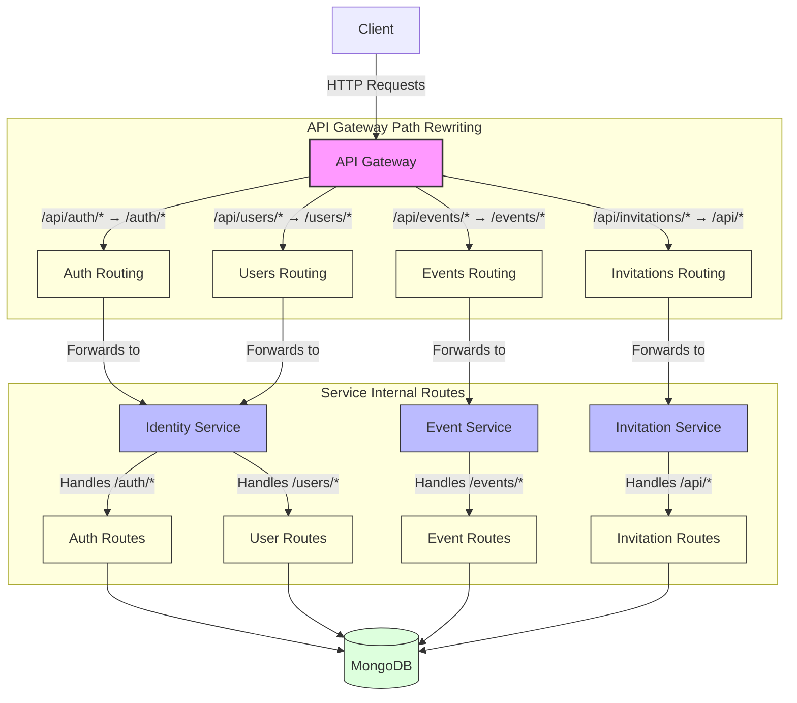
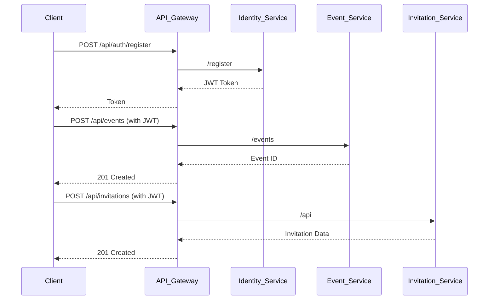

# Olive Table - API Gateway & Microservices

This repository contains a microservices architecture with:
- **API Gateway**: Reverse proxy with JWT authentication and path rewriting
- **Identity Service**: User registration and authentication
- **Event Service**: Event management (CRUD operations)
- **Invitation Service**: Invitation and RSVP management

---

## Project Summary

The Olive Table platform implements a microservices architecture to support KinMeal Social - a dietary-aware social gathering platform that helps users plan events while accounting for diverse dietary needs, preferences, and restrictions.

### Key Features
- User dietary profile management with restriction flexibility scales
- Event planning and invitation system with RSVP tracking
- Group dietary analysis and compatibility visualization
- Recipe management with dietary filtering
- Food and beverage discovery sharing
- Content creator integration

### Technology Stack
- Microservices architecture for scalability
- JWT-based authentication
- MongoDB for data persistence
- Node.js backend services
- RESTful API design
- Docker support for containerization

---

## Architectural Overview



---

## Key Components

1. **API Gateway** (`/services/api-gateway`)
  - Entry point for all requests
  - Handles:
    - JWT Authentication
    - Path Rewriting:
      - `/api/auth/*` → Identity Service
      - `/api/events/*` → `/events/*` (Event Service)
      - `/api/invitations/*` → `/api/*` (Invitation Service)
2. **Identity Service** (`/services/identity-service`)
  - Manages:
    - User registration (`POST /api/auth/register`)
    - User login (`POST /api/auth/login`)
  - Key files:
    - `authController.js` (register/login logic)
    - `User.js` (Mongoose model)
3. **Event Service** (`/services/event-service`)
  - Handles:
    - Event CRUD operations
  - Key endpoints:
    - `POST /events` (Create event)
    - `GET /events/:id` (Get event)
4. **Invitation Service** (`/services/invitation-service`)
  - Manages:
    - Invitations
    - RSVPs
  - Key files:
    - `invitationController.js`
    - `Invitation.js` (Mongoose model)

---

## Local Development Setup

### 1. Prerequisites
 - [Node.js](https://www.nodejs.org) (v18+ recommended)
```bash
node --version
# or
node -v
```
 - [MongoDB](https://www.mongodb.com) (running locally or via Docker)
```bash
mongod --version
```
 - [Docker](https://www.docker.com/) (optional, for containerized setup)
```bash
docker --version
# or
docker -v
```

### 2. Clone and Configure
```bash
git clone https://github.com/your-repo/olive-table.git
cd olive-table
```

#### Create `.env` files in each service directory:
```bash
# services/api-gateway/.env
NODE_ENV=development
PORT=3000
IDENTITY_SERVICE=http://identity-service:3001
EVENT_SERVICE=http://event-service:3002
INVITATION_SERVICE=http://invitation-service:3003
JWT_SECRET=replace_this_with_a_long_random_string_you_generated

# services/identity-service/.env
NODE_ENV=development
PORT=3001
DB_CONNECTION=mongodb://mongo:27017/identity
JWT_SECRET=same_as_jwt_secret_stored_in_api_gateway_.env

# services/event-service/.env 
NODE_ENV=development
PORT=3002
DB_CONNECTION=mongodb://mongo:27017/events

# services/invitation-service/.env
NODE_ENV=development
PORT=3003
DB_CONNECTION=mongodb://mongo:27017/invitations
```

### 3. Install Dependencies

#### API Gateway
```bash
cd services/api-gateway && npm install
```

####  Identity Service
```bash
cd ../identity-service && npm install
```

#### Event Service
```bash
cd services/api-gateway && npm install
```

#### Invitation Service
```bash
cd ../identity-service && npm install
```

### 4. Start/Stop Services

#### Launch Docker Desktop and Build Container for each Service

After launching Docker Desktop, run this command in a new terminal:
```bash
docker compose up --build
```

#### Complete Cleanup when you need a fresh start again:
```bash
docker compose down --volumes --rmi all --remove-orphans
```

This is the most thorough cleanup, which:

- Stops and removes containers
- Removes volumes
- Removes images
- Removes orphaned containers (containers not defined in your compose file but connected to the same network)

### 5. Verify Setup
```bash
# Check services directly

# Api-Gateway   
curl http://localhost:3000/health # Should return { "status": "ok" }

# Identity
curl http://localhost:3001/health # Should return { "status": "ok" }

# Events
curl http://localhost:3002/health # Should return { "status": "ok" }

# Invitation
curl http://localhost:3003/health # Should return { "status": "ok" }
```

### 6. First-Time User Setup
#### 1. Register a user:
```bash
curl -X POST http://localhost:3000/api/auth/register \
  -H "Content-Type: application/json" \
  -d '{
    "firstName":"Eugene",
    "lastName":"Kim",
    "email":"test@example.com",
    "password":"password123"
    }'
```

#### 2. Login to get JWT token and user ID:
```bash
curl -X POST http://localhost:3000/api/auth/login \
  -H "Content-Type: application/json" \
  -d '{"email":"test@example.com","password":"password123"}'
```

#### 3. Use the returned token and user ID in subsequent requests:
```bash
curl -X POST http://localhost:3000/api/events \
  -H "Content-Type: application/json" \
  -H "Authorization: Bearer YOUR_JWT_TOKEN" \
  -d '{
    "title": "Test Event",
    "description": "Test Description",
    "date": "YYYY-MM-DD_HAS_TO_BE_IN_THE_FUTURE",
    "startTime":"18:00",
    "location": "Test Location",
    "visibility": "public",
    "creatorId": "YOUR_USER_ID"
  }'
```

### Troubleshooting

- **Port conflicts**: Ensure ports 3000-3003 are free
- **MongoDB connection**: Verify MongoDB is running (`mongod`)
- **Environment variables**: Double-check `.env` files in each service
- **Docker issues**: Run `docker system prune` if containers fail to start

---

## Complete Request Flow Example

### **User Registration → Event Creation → Invitation Flow:**



---

## Development Roadmap

For the MVP (Minimum Viable Product), we will focus on:

1. **Core User Profile Management**
   - Basic dietary profile creation (allergies, restrictions, preferences)
   - Simple flexibility scale for each restriction
   - Family/household member profiles

2. **Essential Event Planning**
   - Basic event creation with date, time, location
   - Invitation system via email
   - RSVP tracking with dietary information collection

3. **Fundamental Dietary Analysis**
   - Basic compatibility analysis for group meals
   - Visual indicators for common restrictions
   - Simple accommodation suggestions

4. **Basic Recipe Management**
   - Limited recipe database focused on common dietary needs
   - Simple filtering by major restriction types
   - Basic modification suggestions

Future phases will implement the additional features outlined in the complete Software Requirements Specification.

---

## Project Structure
```
services/
├── api-gateway/
│   ├── src/
│   │   ├── middleware/
│   │   │   └── auth.js       # JWT verification
│   │   └── index.js          # Proxy configuration
│
├── identity-service/
│   ├── src/
│   │   ├── api/
│   │   │   ├── controllers/
│   │   │   │   └── authController.js
│   │   │   └── routes/
│   │   │       └── auth.js
│   │   └── domain/
│   │       └── models/
│   │           └── User.js
│
├── event-service/
│   ├── src/
│   │   ├── api/
│   │   │   ├── controllers/
│   │   │   │   └── eventController.js
│   │   │   └── routes/
│   │   │       └── events.js
│   │   └── domain/
│   │       └── models/
│   │           └── Event.js
│
└── invitation-service/
    ├── src/
    │   ├── api/
    │   │   ├── controllers/
    │   │   │   └── invitationController.js
    │   │   └── routes/
    │   │       └── invitations.js
    │   └── domain/
    │       └── models/
    │           └── Invitation.js
```

---

## Key Implementation Files

| Service          | File                          | Key Functions/Middleware       |
|------------------|-------------------------------|--------------------------------|
| **API Gateway**  | `middleware/auth.js`          | `verifyToken()`                |
|                  | `index.js`                    | Proxy configuration            |
| **Identity**     | `authController.js`           | `register()`, `login()`        |
| **Event**        | `eventController.js`          | `createEvent()`, `getEvents()` |
| **Invitation**   | `invitationController.js`     | `createInvitation()`           |

### Usage Examples:
- **Authentication**: `verifyToken()` middleware checks JWT before routing to protected services
- **Event Creation**: `createEvent()` handles validation and MongoDB persistence
- **User Registration**: `register()` hashes passwords and generates JWTs

---

## API Endpoints

### Identity Service

- `POST /api/auth/register` - User registration
- `POST /api/auth/login` - User authentication

### Event Service

- `POST /api/events` - Create new event
- `GET /api/events` - List all events
- `GET /api/events/:id` - Get event details
- `PUT /api/events/:id` - Update event
- `DELETE /api/events/:id` - Delete event

### Invitation Service

- `POST /api/invitations` - Create invitation
- `GET /api/invitations` - List invitations
- `PUT /api/invitations/:id` - Update RSVP status

---

## Debugging

### View logs for each service:

#### If running locally:
```bash
# API Gateway
tail -f services/api-gateway/logs/app.log

# Identity Service
tail -f services/identity-service/logs/app.log

# Event Service
tail -f services/event-service/logs/app.log

# Event Service
tail -f services/invitation-service/logs/app.log
```

#### Or, if running Docker:
```bash
docker compose logs api-gateway -f # Logs for the API Gateway service
docker compose logs identity-service -f # Logs for the identity service
docker compose logs event-service -f # Logs for the event service
docker compose logs invitation-service -f # Logs for the invitation service
```

---

## Error Handling

### - **401 Unauthorized**: Invalid/missing JWT'
### - **404 Not Found**: Invalid route
### - **500 Server Error**: Database/validation issues

---

This README provides a high-level overview of the project setup, usage, and testing of the endpoints. Please make sure to replace the placeholders with your own credentials and IDs to ensure proper functionality.
